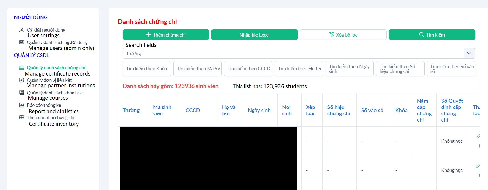

# Certificate Management System - Documentation

A certificate management system for educational institutions that tracks students, graduation certificates, issuing schools, and verification records. 

The platform was developed to improve student access to certificate records for partner institutions. Previously, students had to retrieve or verify records directly through the institution’s administrative office. The online lookup system allows certificate information to be accessed instantly and remotely.

The production deployment runs on a single VPS hosting the frontend, backend API, and MongoDB instance behind an Nginx reverse proxy. The system is currently deployed and used in production by 25+ educational institutions.

**This repository contains documentation only. The codebase is closed source.**

Full write-up on building this as a solo Year 1 student:
[Does vibe coding actually work?](https://kubogi.github.io/2025/12/28/vibe-coding.html)

## Admin Dashboard



*Admin dashboard used by staff to manage certificate records, student data, partner institutions, inventory tracking, and bulk Excel imports.*

## System Architecture

This project is architected to separate public-facing verification from internal administrative workflows. The full technical breakdown can be found in [architecture.md](architecture.md).

### Conceptual Overview
The application is a small dual-interface certificate management system:

- A **public certificate lookup** at `/lookup` that anyone can use without
  logging in.
- An **admin dashboard** at `/admin/*` for staff to manage students, schools,
  certificate inventory, transactions, and user accounts.

It is a single-tenant, single-process system. There are no background workers,
no message queues, no caches, no search indexes, no microservices. Every
operation is request-driven and synchronous.


```text
Public Users ──► Vue SPA (/lookup)
                         │
Admin Staff ──► Vue SPA (/admin/*)
                         │
                         ▼
                  Express 5 API
                         ▼
                     MongoDB
```

## Tech Stack

### Frontend
- Vue 3
- Vue Router
- Axios
- Vite

### Backend
- Node.js
- Express 5
- MongoDB
- Mongoose 8
- JWT authentication

### Deployment / Infrastructure
- Private VPS hosting
- Nginx reverse proxy
- PM2 process management
- MongoDB (self-hosted)

## Environment

All env vars live in a single `.env` at the repo root. `backend/server.js` loads it via `dotenv.config({ path: '../.env' })`.

| Variable | Used by | Purpose |
|---|---|---|
| `URI` | backend | MongoDB connection string |
| `CORS_ORIGIN` | backend | Allowed CORS origin (e.g. `http://localhost:5173`). Defaults to `*`. |
| `JWT_SECRET` | backend | Secret for signing/verifying JWTs. Must be set; no default. |
| `PORT` | backend | Server port (defaults to whatever you set; common: `5005`). |
| `VITE_DEBUG` | frontend (build-time) | `0` ⇒ axios uses same-origin (empty base URL); any other value ⇒ uses `VITE_API_BASE_URL`. See [frontend/README.md](frontend/README.md). |
| `VITE_API_BASE_URL` | frontend (build-time) | Full backend URL (e.g. `http://localhost:5005`). Only consulted when `VITE_DEBUG != 0`. |

## Repo layout

```
student-lookup/
├── backend/         # Express 5 + MongoDB (Mongoose) API server
├── frontend/        # Vue 3 + Vue Router + PrimeVue SPA (Sakai template)
├── docs/            # This documentation tree
├── .env             # Shared env config (loaded by both server + register/dedupe scripts)
└── example.env      # Template for .env
```

The repo is **not** a workspaces monorepo — `backend/` and `frontend/` each have their own `package.json` and `node_modules`. There is also a top-level `package.json` that holds a duplicate set of backend dependencies; it is unused by the running server but installed by mistake. Treat the workspace-level dependencies in `backend/package.json` as authoritative.

## Documentation map

Start with the glossary, then drill into whichever layer you're working on.

- [glossary.md](glossary.md) — Vietnamese ↔ English field/term reference. Read this first.
- [architecture.md](architecture.md) — system-level architecture: components, request lifecycles, deployment topology, and key design decisions
- **Backend**
  - [backend/README.md](backend/README.md) — server bootstrap, middleware, folder map
  - [backend/auth.md](backend/auth.md) — JWT flow, role enforcement, sliding token refresh
  - [backend/excel.md](backend/excel.md) — bulk import/export pipeline
  - [backend/scripts.md](backend/scripts.md) — `register.js`, `remove_dupes.js`
  - [backend/schemas/](backend/schemas/) — one file per Mongoose model
- **API**
  - [api/README.md](api/README.md) — conventions, auth header format, error shape, role matrix
  - [api/endpoints/](api/endpoints/) — endpoints grouped by domain (auth, users, lookup, students, schools, inventory, transactions)
- **Frontend**
  - [frontend/README.md](frontend/README.md) — stack, dev commands, env vars, what's template boilerplate
  - [frontend/architecture.md](frontend/architecture.md) — routing, auth, axios, state
  - [frontend/components/](frontend/components/) — views and composables, by area

## Known gotchas

A few things will surprise a new contributor; each is called out in the relevant doc:

1. **Empty `models/Transaction.js`** — endpoints under `/api/admin/transactions/*` operate on the `Action` model, not `Transaction`. The empty file is dead code.
2. **`backend/config.json`** — references a hardcoded Windows path. Not loaded by the server. Dead config.
3. **No `Bearer ` on requests, but `Bearer ` on refresh response** — see [backend/auth.md](backend/auth.md). The frontend handles the asymmetry by stripping `Bearer ` before storing the refreshed token.
4. **Two parallel APIs for inventory and transactions** — the legacy `POST /insert_inventory` / `POST /insert_action` (bulk, accepts arrays) and the REST-style `POST/PUT/DELETE /inventory/:id` / `/transactions/:id` (single records) coexist. Both are used by the frontend.
5. **`filter_inventory` and `filter_actions` field lists don't match their schemas** — see [api/endpoints/inventory.md](api/endpoints/inventory.md) and [api/endpoints/transactions.md](api/endpoints/transactions.md). These endpoints look like leftovers from an earlier data model.

## Status

Documentation is actively maintained alongside development.